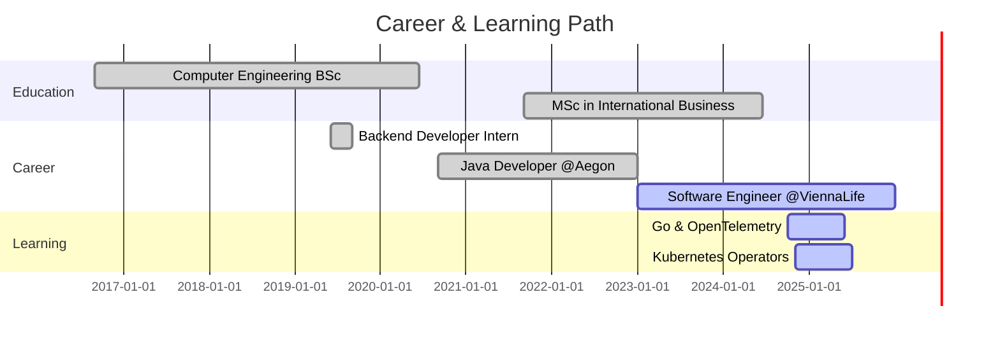

<!-- Theme switching is not supported in GitHub markdown, but kept for aesthetic context -->
<p align="right">
  🌞 <strong>Light Mode</strong> | 🌙 <strong>Dark Mode</strong>
</p>

<h1 align="center">🚀 Hi there, I'm <span style="color:#4FC3F7">Barış Karapelit</span> 👋</h1>
<h3 align="center">💻 Full Stack Developer | ☁️ Cloud & DevOps Enthusiast | 🧠 Lifelong Learner</h3>

<p align="center">
  <a href="https://github.com/BarisKarapelit">
    
  </a>
  <a href="https://stackoverflow.com/users/16427064/bar%c4%b1%c5%9f-karapelit">
    
  </a>
  <a href="https://www.reddit.com/user/Difficult-Ad-6551">
    
  </a>
  <a href="https://github.com/BarisKarapelit?tab=followers">
    
  </a>
  <a href="https://www.linkedin.com/in/bar%C4%B1%C5%9Fkarapelit/">
    
  </a>
</p>

---

### 👨‍💼 About Me

- 🏢 I’m currently working at **[ViennaLife][company]**
- 🔭 I’m exploring scalable microservices with **Spring Boot**, **Docker**, and **Kubernetes**
- 🌱 Currently diving deeper into **C#**, **Go**, and **JavaScript**
- 💬 Ask me anything on my **[issues page][issues page]**
- 🎯 I'm passionate about building clean architectures and solving real-world problems

---

### 🛠️ Tech Stack & Tools

> Languages, platforms, and tools I love to work with:

<div align="center">
  
  
</div>

---

### 📈 Coding Activity

> Daily activity trend based on my development workflow. Updated automatically.

```
             ┼─────────────┬─────────────┬─────────────┬─────────────┬─────────────┬─────────────┬─────────────┤ 
            -7d           -6d           -5d           -4d           -3d           -2d           -1d           now
```

---

### 📌 Featured Projects

Here are some of the projects I've been working on recently:

- 🔐 [User Management System](https://github.com/BarisKarapelit/user-management) — Role-based user and permission structure with Spring Security
- 🧾 [Aegon Dividend Service](https://github.com/BarisKarapelit/aegon-dividend-service) — Microservice for financial dividend processing
- 💬 [Messaging API Integration](https://github.com/BarisKarapelit/smartmessage-integration) — SmartMessage/Moreum messaging service integration with async architecture

---

### 📫 Let's Connect

I'm always open to collaboration, learning from others, or just chatting about tech! Feel free to reach out:

- 💼 [LinkedIn](https://www.linkedin.com/in/bar%C4%B1%C5%9Fkarapelit/)
- 💬 [GitHub Discussions](https://github.com/BarisKarapelit?tab=discussions)
- 📮 You can also open an issue for Q&A on my [repo issues page][issues page]

---

### 🎯 Learning Goals

These are the technologies and topics I'm currently exploring or aiming to master:

- 🧠 Advanced Go (Golang) concurrency and microservices
- ☸️ Kubernetes operator design & GitOps
- 🛡️ OpenID Connect & enterprise-level authentication
- 📊 Observability with OpenTelemetry and distributed tracing

---

### ✨ Fun Facts

- 🎮 I love strategy games and tinkering with automation tools in my free time.
- 🎧 I listen to Yalın while coding — music keeps the creativity flowing!
- 🧩 I enjoy solving algorithm challenges and participating in hackathons.
- 🌍 I'm curious about global tech communities and cross-cultural collaboration.

---

### 📜 Certifications

- ✅ AWS Certified Cloud Practitioner (in progress)
- ✅ Java Spring Professional Track (Patika+)
- ✅ Docker & Kubernetes Hands-On (Udemy)
- ✅ OpenSearch Essentials (self-paced)

---

### 📅 Timeline



---

[company]: https://viennalife.com.tr
[issues page]: https://github.com/BarisKarapelit/The-Complete-2022-Web-Development-Bootcamp/issues
[linkedin]: https://www.linkedin.com/in/bar%C4%B1%C5%9Fkarapelit/
